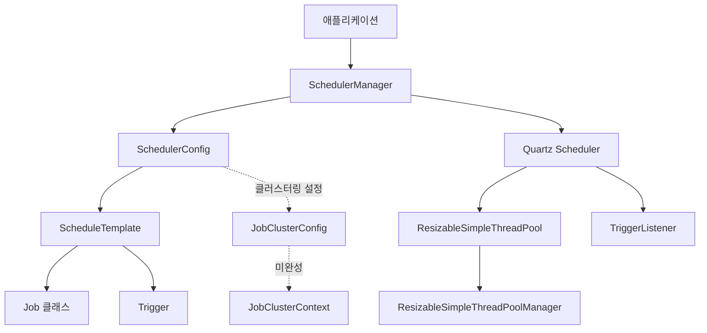

# Dynamic Scheduler

<div align="left">
  <h2>Dynamic Scheduler</h2>
</div>

## 📋 프로젝트 소개

Dynamic Scheduler는 Quartz Scheduler를 기반으로 한 Java 스케줄링 라이브러리입니다. 동적 스레드 풀 관리, 다중 스케줄러 인스턴스 관리, 런타임 Job 추가/제거 등 고급 기능을 제공하여 유연하고 확장 가능한 스케줄링 솔루션을 제공합니다.

### 주요 특징

- **동적 스레드 풀 관리**: 런타임에 스레드 수를 동적으로 조정할 수 있는 `ResizableSimpleThreadPool` 제공
- **다중 스케줄러 관리**: 여러 스케줄러 인스턴스를 중앙에서 관리하는 `SchedulerManager`
- **런타임 Job 관리**: 스케줄러 실행 중에도 Job을 추가하거나 제거 가능
- **자동 스레드 조정**: Job 개수에 따라 스레드 풀 크기를 자동으로 조정
- **다양한 트리거 타입**: Cron, Simple, Calendar Interval, Daily Time Interval 트리거 지원
- **클러스터링 지원**: DB, File, TCP 기반 클러스터링 지원 (⚠️ 개발 중)

### 사용 사례

- 주기적인 데이터 처리 작업
- 배치 작업 스케줄링
- 시스템 모니터링 및 알림
- 리포트 생성 및 전송
- 데이터 동기화 작업

## ✨ 주요 기능

- ✅ **동적 스레드 풀 관리** (`ResizableSimpleThreadPool`) - 완료
- ✅ **다중 스케줄러 인스턴스 관리** (`SchedulerManager`) - 완료
- ✅ **런타임 Job 추가/제거** - 완료
- ✅ **자동 스레드 수 조정** - 완료
- ⚠️ **클러스터링 지원** (DB, File, TCP) - **미완성** (개발 중)
- ✅ **다양한 트리거 타입 지원** (Cron, Simple, Calendar Interval, Daily Time Interval) - 완료

## 🛠 기술 스택

- **Java** - 프로그래밍 언어
- **Gradle** - 빌드 도구
- **Quartz Scheduler 2.3.2** - 스케줄링 엔진
- **Lombok** - 코드 간소화
- **Log4j2** - 로깅
- **Netty** - 클러스터링 통신 (개발 중)

## 🚀 시작하기

### 요구사항

- Java 8 이상
- Gradle 6.0 이상 (또는 Gradle Wrapper 사용)

### 빌드 방법

```bash
# 프로젝트 클론
git clone <repository-url>
cd Scheduler

# Gradle Wrapper를 사용한 빌드
./gradlew build

# Windows의 경우
gradlew.bat build
```

### 기본 사용 예제

가장 간단한 Cron 스케줄러 예제입니다:

```java
import lab.scheduler.config.ScheduleTemplate;
import lab.scheduler.config.SchedulerConfig;
import lab.scheduler.core.SchedulerManager;

public class BasicExample {
    public static void main(String[] args) throws Exception {
        // (1) SchedulerManager 인스턴스 생성
        SchedulerManager manager = SchedulerManager.getInstance();

        // (2) SchedulerConfig 생성 및 설정
        SchedulerConfig config = new SchedulerConfig();
        config.setAutoAdjustThreadCount(true); // Job 개수에 따라 스레드 자동 조정
        config.setMaxThreadCount(100); // 최대 스레드 수 설정

        // (3) ScheduleTemplate 생성
        ScheduleTemplate template = new ScheduleTemplate();
        template.setJobClass(MyJob.class); // Job 클래스 설정
        template.setCronExpression("0/5 * * * * ?"); // 5초마다 실행
        template.setJobName("MyScheduledJob");
        template.addJobParam("param1", "value1");

        // (4) Template을 Config에 추가
        config.addScheduleTemplate(template);

        // (5) 스케줄러 등록 및 시작
        String schedulerId = manager.registerScheduler(config);
        manager.startScheduler(schedulerId);
    }
}
```

## 📖 사용법

### SchedulerManager 초기화

`SchedulerManager`는 싱글톤 패턴으로 구현되어 있습니다:

```java
SchedulerManager manager = SchedulerManager.getInstance();
```

### SchedulerConfig 설정

`SchedulerConfig`는 스케줄러의 전반적인 설정을 담당합니다:

```java
SchedulerConfig config = new SchedulerConfig();

// 스레드 풀 설정
config.setAutoAdjustThreadCount(true); // Job 개수에 따라 자동 조정 (기본값: true)
config.setThreadCount(10); // 초기 스레드 수 (autoAdjustThreadCount가 true면 무시됨)
config.setMaxThreadCount(100); // 최대 스레드 수

// 스레드 풀 이름 설정
config.setThreadPoolName("MyThreadPool");

// 종료 옵션 설정
config.setShutdownAfterAllJobsDone(true); // 모든 Job 완료 후 종료

// Properties 파일에서 설정 로드
config.setPropertiesFileLocation("quartz.properties");
```

### ScheduleTemplate 생성 및 설정

`ScheduleTemplate`은 Job과 Trigger 정보를 포함합니다.

#### Cron 트리거 설정

```java
ScheduleTemplate template = new ScheduleTemplate();
template.setJobClass(MyJob.class);
template.setCronExpression("0 0 12 * * ?"); // 매일 정오에 실행
template.setJobName("DailyJob");
template.setPriority(10); // 우선순위 설정 (높을수록 우선)
template.addJobParam("key", "value");
```

#### Simple 트리거 설정

```java
ScheduleTemplate template = new ScheduleTemplate();
template.setTriggerType(TriggerType.SIMPLE_TRIGGER);
template.setJobClass(MyJob.class);
template.setStartTime("2024-01-01 00:00:00"); // 시작 시간
template.setEndTime("2024-12-31 23:59:59"); // 종료 시간
template.setRepeatCount(-1); // -1이면 무한 반복
template.setRepeatInterval(5); // 반복 간격
template.setIntervalUnit(DateBuilder.IntervalUnit.SECOND); // 간격 단위
template.setJobName("SimpleJob");
```

#### Calendar Interval 트리거 설정

```java
ScheduleTemplate template = new ScheduleTemplate();
template.setTriggerType(TriggerType.CALENDAR_INTERVAL_TRIGGER);
template.setJobClass(MyJob.class);
template.setStartTime("NOW"); // 즉시 시작
template.setRepeatInterval(3);
template.setIntervalUnit(DateBuilder.IntervalUnit.DAY); // 3일마다 실행
template.setJobName("CalendarJob");
```

#### Daily Time Interval 트리거 설정

```java
ScheduleTemplate template = new ScheduleTemplate();
template.setTriggerType(TriggerType.DAILY_TIME_INTERVAL_TRIGGER);
template.setJobClass(MyJob.class);
template.setStartTimeOfDay("09:00:00"); // 매일 9시부터
template.setEndTimeOfDay("18:00:00"); // 18시까지
template.setRepeatInterval(2);
template.setIntervalUnit(DateBuilder.IntervalUnit.HOUR); // 2시간마다 실행
template.setJobName("DailyTimeJob");
```

### 런타임 Job 추가/제거

스케줄러가 실행 중일 때도 Job을 추가하거나 제거할 수 있습니다:

```java
// Job 추가
ScheduleTemplate newTemplate = new ScheduleTemplate();
newTemplate.setJobClass(NewJob.class);
newTemplate.setCronExpression("0 * * * * ?");
newTemplate.setJobName("NewJob");

// 스레드 풀에 스레드도 함께 추가 (true)
manager.addScheduleJob(schedulerId, newTemplate, true);

// Job 제거
// 스레드 풀에서 스레드도 함께 제거 (true)
manager.removeScheduleJob(schedulerId, "NewJob", true);

// 또는 설정에 따라 자동으로 스레드 제거 여부 결정
manager.removeScheduleJob(schedulerId, "NewJob");
```

### 스케줄러 시작/중지

```java
// 특정 스케줄러 시작
manager.startScheduler(schedulerId);

// 모든 스케줄러 시작
Map<String, Exception> results = manager.startAllSchedulers();

// 특정 스케줄러 중지
manager.stopScheduler(schedulerId);

// 모든 스케줄러 중지
Map<String, Exception> results = manager.stopAllSchedulers();

// 스케줄러 제거
manager.removeScheduler(schedulerId);
```

## 🏗 아키텍처

### 핵심 클래스

- **SchedulerManager**: 모든 스케줄러 인스턴스를 중앙에서 관리하는 싱글톤 클래스
- **SchedulerConfig**: 스케줄러의 설정 정보를 담는 클래스
- **ScheduleTemplate**: Job과 Trigger 정보를 포함하는 템플릿 클래스
- **ResizableSimpleThreadPool**: 동적으로 크기를 조정할 수 있는 스레드 풀 구현
- **ResizableSimpleThreadPoolManager**: 여러 스레드 풀을 관리하는 매니저

### 컴포넌트 관계도



### 데이터 흐름

1. 애플리케이션에서 `SchedulerManager` 인스턴스 획득
2. `SchedulerConfig` 생성 및 설정
3. `ScheduleTemplate` 생성 및 Job/Trigger 정보 설정
4. Template을 Config에 추가
5. `SchedulerManager`에 Config 등록 → Quartz Scheduler 생성
6. 스케줄러 시작 → Job 실행 시작
7. 런타임에 Job 추가/제거 가능

## 🔧 고급 기능

### 클러스터링 설정 ⚠️ 개발 중

⚠️ **주의**: 클러스터링 기능은 현재 개발 중이며 완전히 구현되지 않았습니다. 사용 시 주의가 필요합니다.

클러스터링을 사용하려면 `JobClusterConfig`를 설정합니다:

```java
JobClusterConfig clusterConfig = new JobClusterConfig();
clusterConfig.setClusterType(JobClusterType.DB_JOBSTORE); // 또는 FILE_JOBSTORE, TCP_COMMUNICATION
clusterConfig.setClusterStrategy(JobClusterStrategy.FREE_HEAP_MEMORY);

// Quartz 클러스터링 Properties 설정
Properties props = new Properties();
props.setProperty("org.quartz.jobStore.class", "org.quartz.impl.jdbcjobstore.JobStoreTX");
// ... 기타 설정
clusterConfig.setQuartzClusteringProperties(props);

SchedulerConfig config = new SchedulerConfig();
config.setClustered(true);
config.setClusterConfig(clusterConfig);
```

**미완성 부분**:
- `JobClusterContext.initialize()` 메서드 미구현
- `JobClusterServer` 파이프라인 핸들러 미구현
- 일부 설정 메서드의 값 설정 누락

### 커스텀 Job 클래스 작성

`org.quartz.Job` 인터페이스를 구현하여 커스텀 Job 클래스를 작성할 수 있습니다:

```java
import org.quartz.Job;
import org.quartz.JobExecutionContext;
import org.quartz.JobExecutionException;

public class MyCustomJob implements Job {
    @Override
    public void execute(JobExecutionContext context) throws JobExecutionException {
        JobDataMap dataMap = context.getJobDetail().getJobDataMap();
        String param = dataMap.getString("param1");
        
        // 작업 로직 구현
        System.out.println("Job executed with param: " + param);
    }
}
```

기본 Job 클래스를 설정하려면:

```java
SchedulerManager manager = SchedulerManager.getInstance();
manager.setDefaultJobClass(MyCustomJob.class);
// 또는
manager.setDefaultJobClass("com.example.MyCustomJob");
```

### 리스너 활용

`NextFireTimeCheckTriggerListener`는 Trigger 완료 후 다음 실행 시간을 확인하고, 다음 실행 시간이 없으면 Job을 자동으로 제거합니다.

⚠️ **주의**: 현재 `triggerFired()`와 `triggerMisfired()` 메서드는 비어있습니다.

커스텀 리스너를 추가할 수 있습니다:

```java
Scheduler scheduler = manager.getScheduler(schedulerId);

// Job 리스너 추가
manager.addJobListener(scheduler, new MyJobListener());

// Trigger 리스너 추가
manager.addTriggerListener(scheduler, new MyTriggerListener());
```

### 스레드 풀 동적 조정

스레드 풀 크기는 런타임에 동적으로 조정됩니다:

- Job 추가 시: 스레드가 필요하면 자동으로 추가 (설정에 따라)
- Job 제거 시: 스레드가 필요 없으면 자동으로 제거 (설정에 따라)
- 최소 스레드 수: 항상 1개 이상 유지
- 최대 스레드 수: `setMaxThreadCount()`로 설정한 값까지

## 💡 예제 코드

### Cron 스케줄러 예제

```java
import lab.scheduler.config.ScheduleTemplate;
import lab.scheduler.config.SchedulerConfig;
import lab.scheduler.core.SchedulerManager;

public class CronSchedulerExample {
    public static void main(String[] args) throws Exception {
        SchedulerManager manager = SchedulerManager.getInstance();
        
        SchedulerConfig config = new SchedulerConfig();
        config.setAutoAdjustThreadCount(true);
        config.setMaxThreadCount(100);
        
        ScheduleTemplate template = new ScheduleTemplate();
        template.setJobClass(MyJob.class);
        template.setCronExpression("0/3 * * * * ?"); // 3초마다 실행
        template.setJobName("MyServiceLogic");
        template.setPriority(10);
        template.addJobParam("template name", "template1");
        
        config.addScheduleTemplate(template);
        
        String schedulerId = manager.registerScheduler(config);
        manager.startScheduler(schedulerId);
        
        // 7초 후 새로운 Job 추가
        Thread.sleep(7000);
        ScheduleTemplate template2 = new ScheduleTemplate();
        template2.setJobClass(MyJob.class);
        template2.setCronExpression("0/3 * * * * ?");
        template2.setJobName("MyServiceLogic_2");
        manager.addScheduleJob(schedulerId, template2, true);
    }
}
```

### Simple 스케줄러 예제

```java
import lab.scheduler.config.TriggerType;
import org.quartz.DateBuilder;

public class SimpleSchedulerExample {
    public static void main(String[] args) throws Exception {
        SchedulerManager manager = SchedulerManager.getInstance();
        
        SchedulerConfig config = new SchedulerConfig();
        config.setAutoAdjustThreadCount(true);
        config.setMaxThreadCount(100);
        
        ScheduleTemplate template = new ScheduleTemplate();
        template.setTriggerType(TriggerType.SIMPLE_TRIGGER);
        template.setJobClass(MyJob.class);
        template.setStartTime("NOW");
        template.setRepeatCount(-1); // 무한 반복
        template.setRepeatInterval(5);
        template.setIntervalUnit(DateBuilder.IntervalUnit.SECOND);
        template.setJobName("SimpleJob");
        
        config.addScheduleTemplate(template);
        
        String schedulerId = manager.registerScheduler(config);
        manager.startScheduler(schedulerId);
    }
}
```

### Calendar Interval 스케줄러 예제

```java
import lab.scheduler.config.TriggerType;
import org.quartz.DateBuilder;

public class CalendarIntervalSchedulerExample {
    public static void main(String[] args) throws Exception {
        SchedulerManager manager = SchedulerManager.getInstance();
        
        SchedulerConfig config = new SchedulerConfig();
        config.setAutoAdjustThreadCount(true);
        config.setMaxThreadCount(100);
        
        ScheduleTemplate template = new ScheduleTemplate();
        template.setTriggerType(TriggerType.CALENDAR_INTERVAL_TRIGGER);
        template.setJobClass(MyJob.class);
        template.setStartTime("NOW");
        template.setRepeatInterval(3);
        template.setIntervalUnit(DateBuilder.IntervalUnit.DAY); // 3일마다 실행
        template.setJobName("CalendarJob");
        
        config.addScheduleTemplate(template);
        
        String schedulerId = manager.registerScheduler(config);
        manager.startScheduler(schedulerId);
    }
}
```

### 런타임 Job 관리 예제

```java
public class RuntimeJobManagementExample {
    public static void main(String[] args) throws Exception {
        SchedulerManager manager = SchedulerManager.getInstance();
        
        SchedulerConfig config = new SchedulerConfig();
        config.setAutoAdjustThreadCount(true);
        config.setMaxThreadCount(100);
        
        // 초기 Job 설정
        ScheduleTemplate template1 = new ScheduleTemplate();
        template1.setJobClass(MyJob.class);
        template1.setCronExpression("0/5 * * * * ?");
        template1.setJobName("Job1");
        config.addScheduleTemplate(template1);
        
        String schedulerId = manager.registerScheduler(config);
        manager.startScheduler(schedulerId);
        
        // 런타임에 Job 추가
        Thread.sleep(5000);
        ScheduleTemplate template2 = new ScheduleTemplate();
        template2.setJobClass(MyJob.class);
        template2.setCronExpression("0/10 * * * * ?");
        template2.setJobName("Job2");
        manager.addScheduleJob(schedulerId, template2, true);
        
        // 런타임에 Job 제거
        Thread.sleep(10000);
        manager.removeScheduleJob(schedulerId, "Job1", true);
    }
}
```

## 📁 프로젝트 구조

```
Scheduler/
├── build.gradle                 # Gradle 빌드 설정
├── settings.gradle              # Gradle 프로젝트 설정
├── gradlew                      # Gradle Wrapper (Unix)
├── gradlew.bat                  # Gradle Wrapper (Windows)
├── README.md                    # 프로젝트 문서
└── src/
    └── main/
        ├── java/
        │   └── lab/
        │       └── scheduler/
        │           ├── SchedulerApplication.java    # 애플리케이션 진입점 (미구현)
        │           ├── cluster/                    # 클러스터링 관련 클래스
        │           │   ├── JobClusterContext.java  # 클러스터 컨텍스트 (미완성)
        │           │   ├── JobClusterOption.java   # 클러스터 옵션
        │           │   ├── JobClusterServer.java   # 클러스터 서버 (미완성)
        │           │   ├── JobClusterStrategy.java # 클러스터 전략
        │           │   └── JobClusterType.java     # 클러스터 타입
        │           ├── config/                    # 설정 관련 클래스
        │           │   ├── JobClusterConfig.java   # 클러스터 설정
        │           │   ├── ScheduleTemplate.java   # 스케줄 템플릿
        │           │   ├── SchedulerConfig.java    # 스케줄러 설정
        │           │   └── TriggerType.java        # 트리거 타입
        │           ├── core/                      # 핵심 기능 클래스
        │           │   ├── ResizableSimpleThreadPool.java        # 동적 스레드 풀
        │           │   ├── ResizableSimpleThreadPoolManager.java # 스레드 풀 매니저
        │           │   └── SchedulerManager.java   # 스케줄러 매니저
        │           ├── listeners/                 # 리스너 클래스
        │           │   └── NextFireTimeCheckTriggerListener.java # 트리거 리스너 (부분 완성)
        │           └── tutorial/                  # 튜토리얼 예제
        │               ├── Step1_DefineJobClass.java
        │               ├── Step2_StartCronScheduler.java
        │               ├── Step3_StartSimpleScheduler.java
        │               └── Step4_StartCalendarIntervalScheduler.java
        └── resources/
            └── log4j2.xml                        # Log4j2 설정
```

### 주요 패키지 설명

- **`lab.scheduler.core`**: 스케줄러의 핵심 기능을 제공하는 패키지
  - `SchedulerManager`: 모든 스케줄러 인스턴스 관리
  - `ResizableSimpleThreadPool`: 동적 스레드 풀 구현
  - `ResizableSimpleThreadPoolManager`: 스레드 풀 관리

- **`lab.scheduler.config`**: 설정 관련 클래스 패키지
  - `SchedulerConfig`: 스케줄러 전반 설정
  - `ScheduleTemplate`: Job과 Trigger 템플릿
  - `JobClusterConfig`: 클러스터링 설정

- **`lab.scheduler.cluster`**: 클러스터링 기능 패키지 (⚠️ 개발 중)
  - 클러스터링 관련 클래스들이 포함되어 있으나 일부 기능이 미완성

- **`lab.scheduler.listeners`**: 리스너 구현 패키지
  - `NextFireTimeCheckTriggerListener`: Trigger 완료 후 다음 실행 시간 확인

- **`lab.scheduler.tutorial`**: 사용 예제 패키지
  - 다양한 트리거 타입별 사용 예제 제공

## 📝 라이센스

이 프로젝트는 완전 자유 라이센스입니다. 상업적/비상업적 용도로 자유롭게 사용, 수정, 배포할 수 있습니다.

