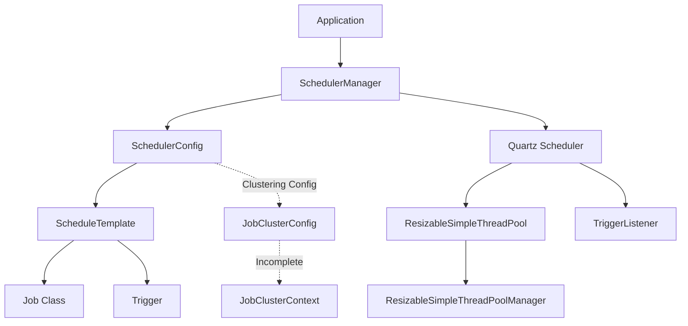

# Dynamic Scheduler

<div align="left">
  <h2>Dynamic Scheduler</h2>
</div>

## 📋 Project Introduction

Dynamic Scheduler is a Java scheduling library based on Quartz Scheduler. It provides advanced features such as dynamic thread pool management, multi-scheduler instance management, and runtime job addition/removal, offering a flexible and scalable scheduling solution.

### Key Features

- **Dynamic Thread Pool Management**: Provides `ResizableSimpleThreadPool` that can dynamically adjust the number of threads at runtime
- **Multi-Scheduler Management**: `SchedulerManager` that centrally manages multiple scheduler instances
- **Runtime Job Management**: Add or remove jobs while the scheduler is running
- **Automatic Thread Adjustment**: Automatically adjusts thread pool size based on the number of jobs
- **Various Trigger Types**: Supports Cron, Simple, Calendar Interval, and Daily Time Interval triggers
- **Clustering Support**: Supports DB, File, and TCP-based clustering (⚠️ Under Development)

### Use Cases

- Periodic data processing tasks
- Batch job scheduling
- System monitoring and alerts
- Report generation and delivery
- Data synchronization tasks

## ✨ Key Features

- ✅ **Dynamic Thread Pool Management** (`ResizableSimpleThreadPool`) - Completed
- ✅ **Multi-Scheduler Instance Management** (`SchedulerManager`) - Completed
- ✅ **Runtime Job Addition/Removal** - Completed
- ✅ **Automatic Thread Count Adjustment** - Completed
- ⚠️ **Clustering Support** (DB, File, TCP) - **Incomplete** (Under Development)
- ✅ **Various Trigger Type Support** (Cron, Simple, Calendar Interval, Daily Time Interval) - Completed

## 🛠 Technology Stack

- **Java** - Programming Language
- **Gradle** - Build Tool
- **Quartz Scheduler 2.3.2** - Scheduling Engine
- **Lombok** - Code Simplification
- **Log4j2** - Logging
- **Netty** - Clustering Communication (Under Development)

## 🚀 Getting Started

### Requirements

- Java 8 or higher
- Gradle 6.0 or higher (or use Gradle Wrapper)

### Build Instructions

```bash
# Clone the project
git clone <repository-url>
cd Scheduler

# Build using Gradle Wrapper
./gradlew build

# For Windows
gradlew.bat build
```

### Basic Usage Example

Here's a simple Cron scheduler example:

```java
import lab.scheduler.config.ScheduleTemplate;
import lab.scheduler.config.SchedulerConfig;
import lab.scheduler.core.SchedulerManager;

public class BasicExample {
    public static void main(String[] args) throws Exception {
        // (1) Create SchedulerManager instance
        SchedulerManager manager = SchedulerManager.getInstance();

        // (2) Create and configure SchedulerConfig
        SchedulerConfig config = new SchedulerConfig();
        config.setAutoAdjustThreadCount(true); // Auto-adjust threads based on job count
        config.setMaxThreadCount(100); // Set maximum thread count

        // (3) Create ScheduleTemplate
        ScheduleTemplate template = new ScheduleTemplate();
        template.setJobClass(MyJob.class); // Set job class
        template.setCronExpression("0/5 * * * * ?"); // Execute every 5 seconds
        template.setJobName("MyScheduledJob");
        template.addJobParam("param1", "value1");

        // (4) Add template to config
        config.addScheduleTemplate(template);

        // (5) Register and start scheduler
        String schedulerId = manager.registerScheduler(config);
        manager.startScheduler(schedulerId);
    }
}
```

## 📖 Usage

### Initializing SchedulerManager

`SchedulerManager` is implemented as a singleton:

```java
SchedulerManager manager = SchedulerManager.getInstance();
```

### Configuring SchedulerConfig

`SchedulerConfig` manages overall scheduler configuration:

```java
SchedulerConfig config = new SchedulerConfig();

// Thread pool configuration
config.setAutoAdjustThreadCount(true); // Auto-adjust based on job count (default: true)
config.setThreadCount(10); // Initial thread count (ignored if autoAdjustThreadCount is true)
config.setMaxThreadCount(100); // Maximum thread count

// Set thread pool name
config.setThreadPoolName("MyThreadPool");

// Shutdown options
config.setShutdownAfterAllJobsDone(true); // Shutdown after all jobs complete

// Load configuration from properties file
config.setPropertiesFileLocation("quartz.properties");
```

### Creating and Configuring ScheduleTemplate

`ScheduleTemplate` contains Job and Trigger information.

#### Cron Trigger Configuration

```java
ScheduleTemplate template = new ScheduleTemplate();
template.setJobClass(MyJob.class);
template.setCronExpression("0 0 12 * * ?"); // Execute daily at noon
template.setJobName("DailyJob");
template.setPriority(10); // Set priority (higher number = higher priority)
template.addJobParam("key", "value");
```

#### Simple Trigger Configuration

```java
ScheduleTemplate template = new ScheduleTemplate();
template.setTriggerType(TriggerType.SIMPLE_TRIGGER);
template.setJobClass(MyJob.class);
template.setStartTime("2024-01-01 00:00:00"); // Start time
template.setEndTime("2024-12-31 23:59:59"); // End time
template.setRepeatCount(-1); // -1 means repeat forever
template.setRepeatInterval(5); // Repeat interval
template.setIntervalUnit(DateBuilder.IntervalUnit.SECOND); // Interval unit
template.setJobName("SimpleJob");
```

#### Calendar Interval Trigger Configuration

```java
ScheduleTemplate template = new ScheduleTemplate();
template.setTriggerType(TriggerType.CALENDAR_INTERVAL_TRIGGER);
template.setJobClass(MyJob.class);
template.setStartTime("NOW"); // Start immediately
template.setRepeatInterval(3);
template.setIntervalUnit(DateBuilder.IntervalUnit.DAY); // Execute every 3 days
template.setJobName("CalendarJob");
```

#### Daily Time Interval Trigger Configuration

```java
ScheduleTemplate template = new ScheduleTemplate();
template.setTriggerType(TriggerType.DAILY_TIME_INTERVAL_TRIGGER);
template.setJobClass(MyJob.class);
template.setStartTimeOfDay("09:00:00"); // From 9 AM daily
template.setEndTimeOfDay("18:00:00"); // Until 6 PM
template.setRepeatInterval(2);
template.setIntervalUnit(DateBuilder.IntervalUnit.HOUR); // Execute every 2 hours
template.setJobName("DailyTimeJob");
```

### Runtime Job Addition/Removal

You can add or remove jobs while the scheduler is running:

```java
// Add job
ScheduleTemplate newTemplate = new ScheduleTemplate();
newTemplate.setJobClass(NewJob.class);
newTemplate.setCronExpression("0 * * * * ?");
newTemplate.setJobName("NewJob");

// Add thread to thread pool as well (true)
manager.addScheduleJob(schedulerId, newTemplate, true);

// Remove job
// Remove thread from thread pool as well (true)
manager.removeScheduleJob(schedulerId, "NewJob", true);

// Or automatically determine thread removal based on configuration
manager.removeScheduleJob(schedulerId, "NewJob");
```

### Starting/Stopping Schedulers

```java
// Start specific scheduler
manager.startScheduler(schedulerId);

// Start all schedulers
Map<String, Exception> results = manager.startAllSchedulers();

// Stop specific scheduler
manager.stopScheduler(schedulerId);

// Stop all schedulers
Map<String, Exception> results = manager.stopAllSchedulers();

// Remove scheduler
manager.removeScheduler(schedulerId);
```

## 🏗 Architecture

### Core Classes

- **SchedulerManager**: Singleton class that centrally manages all scheduler instances
- **SchedulerConfig**: Class that holds scheduler configuration information
- **ScheduleTemplate**: Template class containing Job and Trigger information
- **ResizableSimpleThreadPool**: Thread pool implementation with dynamically adjustable size
- **ResizableSimpleThreadPoolManager**: Manager for multiple thread pools

### Component Diagram



### Data Flow

1. Application obtains `SchedulerManager` instance
2. Create and configure `SchedulerConfig`
3. Create `ScheduleTemplate` and set Job/Trigger information
4. Add template to config
5. Register config with `SchedulerManager` → Quartz Scheduler created
6. Start scheduler → Job execution begins
7. Add/remove jobs at runtime

## 🔧 Advanced Features

### Clustering Configuration ⚠️ Under Development

⚠️ **Warning**: Clustering functionality is currently under development and not fully implemented. Use with caution.

To use clustering, configure `JobClusterConfig`:

```java
JobClusterConfig clusterConfig = new JobClusterConfig();
clusterConfig.setClusterType(JobClusterType.DB_JOBSTORE); // Or FILE_JOBSTORE, TCP_COMMUNICATION
clusterConfig.setClusterStrategy(JobClusterStrategy.FREE_HEAP_MEMORY);

// Configure Quartz clustering properties
Properties props = new Properties();
props.setProperty("org.quartz.jobStore.class", "org.quartz.impl.jdbcjobstore.JobStoreTX");
// ... other settings
clusterConfig.setQuartzClusteringProperties(props);

SchedulerConfig config = new SchedulerConfig();
config.setClustered(true);
config.setClusterConfig(clusterConfig);
```

**Incomplete Parts**:
- `JobClusterContext.initialize()` method not implemented
- `JobClusterServer` pipeline handler not implemented
- Some configuration methods missing value assignments

### Creating Custom Job Classes

You can create custom job classes by implementing the `org.quartz.Job` interface:

```java
import org.quartz.Job;
import org.quartz.JobExecutionContext;
import org.quartz.JobExecutionException;

public class MyCustomJob implements Job {
    @Override
    public void execute(JobExecutionContext context) throws JobExecutionException {
        JobDataMap dataMap = context.getJobDetail().getJobDataMap();
        String param = dataMap.getString("param1");
        
        // Implement job logic
        System.out.println("Job executed with param: " + param);
    }
}
```

To set a default job class:

```java
SchedulerManager manager = SchedulerManager.getInstance();
manager.setDefaultJobClass(MyCustomJob.class);
// Or
manager.setDefaultJobClass("com.example.MyCustomJob");
```

### Using Listeners

`NextFireTimeCheckTriggerListener` checks the next fire time after trigger completion and automatically removes the job if there is no next fire time.

⚠️ **Warning**: Currently, `triggerFired()` and `triggerMisfired()` methods are empty.

You can add custom listeners:

```java
Scheduler scheduler = manager.getScheduler(schedulerId);

// Add job listener
manager.addJobListener(scheduler, new MyJobListener());

// Add trigger listener
manager.addTriggerListener(scheduler, new MyTriggerListener());
```

### Dynamic Thread Pool Adjustment

Thread pool size is dynamically adjusted at runtime:

- When adding jobs: Automatically adds threads if needed (based on configuration)
- When removing jobs: Automatically removes threads if not needed (based on configuration)
- Minimum thread count: Always maintains at least 1 thread
- Maximum thread count: Up to the value set by `setMaxThreadCount()`

## 💡 Example Code

### Cron Scheduler Example

```java
import lab.scheduler.config.ScheduleTemplate;
import lab.scheduler.config.SchedulerConfig;
import lab.scheduler.core.SchedulerManager;

public class CronSchedulerExample {
    public static void main(String[] args) throws Exception {
        SchedulerManager manager = SchedulerManager.getInstance();
        
        SchedulerConfig config = new SchedulerConfig();
        config.setAutoAdjustThreadCount(true);
        config.setMaxThreadCount(100);
        
        ScheduleTemplate template = new ScheduleTemplate();
        template.setJobClass(MyJob.class);
        template.setCronExpression("0/3 * * * * ?"); // Execute every 3 seconds
        template.setJobName("MyServiceLogic");
        template.setPriority(10);
        template.addJobParam("template name", "template1");
        
        config.addScheduleTemplate(template);
        
        String schedulerId = manager.registerScheduler(config);
        manager.startScheduler(schedulerId);
        
        // Add new job after 7 seconds
        Thread.sleep(7000);
        ScheduleTemplate template2 = new ScheduleTemplate();
        template2.setJobClass(MyJob.class);
        template2.setCronExpression("0/3 * * * * ?");
        template2.setJobName("MyServiceLogic_2");
        manager.addScheduleJob(schedulerId, template2, true);
    }
}
```

### Simple Scheduler Example

```java
import lab.scheduler.config.TriggerType;
import org.quartz.DateBuilder;

public class SimpleSchedulerExample {
    public static void main(String[] args) throws Exception {
        SchedulerManager manager = SchedulerManager.getInstance();
        
        SchedulerConfig config = new SchedulerConfig();
        config.setAutoAdjustThreadCount(true);
        config.setMaxThreadCount(100);
        
        ScheduleTemplate template = new ScheduleTemplate();
        template.setTriggerType(TriggerType.SIMPLE_TRIGGER);
        template.setJobClass(MyJob.class);
        template.setStartTime("NOW");
        template.setRepeatCount(-1); // Repeat forever
        template.setRepeatInterval(5);
        template.setIntervalUnit(DateBuilder.IntervalUnit.SECOND);
        template.setJobName("SimpleJob");
        
        config.addScheduleTemplate(template);
        
        String schedulerId = manager.registerScheduler(config);
        manager.startScheduler(schedulerId);
    }
}
```

### Calendar Interval Scheduler Example

```java
import lab.scheduler.config.TriggerType;
import org.quartz.DateBuilder;

public class CalendarIntervalSchedulerExample {
    public static void main(String[] args) throws Exception {
        SchedulerManager manager = SchedulerManager.getInstance();
        
        SchedulerConfig config = new SchedulerConfig();
        config.setAutoAdjustThreadCount(true);
        config.setMaxThreadCount(100);
        
        ScheduleTemplate template = new ScheduleTemplate();
        template.setTriggerType(TriggerType.CALENDAR_INTERVAL_TRIGGER);
        template.setJobClass(MyJob.class);
        template.setStartTime("NOW");
        template.setRepeatInterval(3);
        template.setIntervalUnit(DateBuilder.IntervalUnit.DAY); // Execute every 3 days
        template.setJobName("CalendarJob");
        
        config.addScheduleTemplate(template);
        
        String schedulerId = manager.registerScheduler(config);
        manager.startScheduler(schedulerId);
    }
}
```

### Runtime Job Management Example

```java
public class RuntimeJobManagementExample {
    public static void main(String[] args) throws Exception {
        SchedulerManager manager = SchedulerManager.getInstance();
        
        SchedulerConfig config = new SchedulerConfig();
        config.setAutoAdjustThreadCount(true);
        config.setMaxThreadCount(100);
        
        // Initial job configuration
        ScheduleTemplate template1 = new ScheduleTemplate();
        template1.setJobClass(MyJob.class);
        template1.setCronExpression("0/5 * * * * ?");
        template1.setJobName("Job1");
        config.addScheduleTemplate(template1);
        
        String schedulerId = manager.registerScheduler(config);
        manager.startScheduler(schedulerId);
        
        // Add job at runtime
        Thread.sleep(5000);
        ScheduleTemplate template2 = new ScheduleTemplate();
        template2.setJobClass(MyJob.class);
        template2.setCronExpression("0/10 * * * * ?");
        template2.setJobName("Job2");
        manager.addScheduleJob(schedulerId, template2, true);
        
        // Remove job at runtime
        Thread.sleep(10000);
        manager.removeScheduleJob(schedulerId, "Job1", true);
    }
}
```

## 📁 Project Structure

```
Scheduler/
├── build.gradle                 # Gradle build configuration
├── settings.gradle              # Gradle project settings
├── gradlew                      # Gradle Wrapper (Unix)
├── gradlew.bat                  # Gradle Wrapper (Windows)
├── README.md                    # Project documentation (Korean)
├── README_EN.md                 # Project documentation (English)
└── src/
    └── main/
        ├── java/
        │   └── lab/
        │       └── scheduler/
        │           ├── SchedulerApplication.java    # Application entry point (not implemented)
        │           ├── cluster/                    # Clustering related classes
        │           │   ├── JobClusterContext.java  # Cluster context (incomplete)
        │           │   ├── JobClusterOption.java   # Cluster option
        │           │   ├── JobClusterServer.java   # Cluster server (incomplete)
        │           │   ├── JobClusterStrategy.java # Cluster strategy
        │           │   └── JobClusterType.java     # Cluster type
        │           ├── config/                    # Configuration related classes
        │           │   ├── JobClusterConfig.java   # Cluster configuration
        │           │   ├── ScheduleTemplate.java   # Schedule template
        │           │   ├── SchedulerConfig.java     # Scheduler configuration
        │           │   └── TriggerType.java        # Trigger type
        │           ├── core/                      # Core functionality classes
        │           │   ├── ResizableSimpleThreadPool.java        # Dynamic thread pool
        │           │   ├── ResizableSimpleThreadPoolManager.java  # Thread pool manager
        │           │   └── SchedulerManager.java   # Scheduler manager
        │           ├── listeners/                # Listener classes
        │           │   └── NextFireTimeCheckTriggerListener.java   # Trigger listener (partially complete)
        │           └── tutorial/                   # Tutorial examples
        │               ├── Step1_DefineJobClass.java
        │               ├── Step2_StartCronScheduler.java
        │               ├── Step3_StartSimpleScheduler.java
        │               └── Step4_StartCalendarIntervalScheduler.java
        └── resources/
            └── log4j2.xml                        # Log4j2 configuration
```

### Package Descriptions

- **`lab.scheduler.core`**: Package providing core scheduler functionality
  - `SchedulerManager`: Manages all scheduler instances
  - `ResizableSimpleThreadPool`: Dynamic thread pool implementation
  - `ResizableSimpleThreadPoolManager`: Thread pool management

- **`lab.scheduler.config`**: Package for configuration-related classes
  - `SchedulerConfig`: Overall scheduler configuration
  - `ScheduleTemplate`: Job and Trigger template
  - `JobClusterConfig`: Clustering configuration

- **`lab.scheduler.cluster`**: Clustering functionality package (⚠️ Under Development)
  - Contains clustering-related classes but some features are incomplete

- **`lab.scheduler.listeners`**: Listener implementation package
  - `NextFireTimeCheckTriggerListener`: Checks next fire time after trigger completion

- **`lab.scheduler.tutorial`**: Usage example package
  - Provides examples for various trigger types

## 📝 License

This project is under a completely free license. You are free to use, modify, and distribute it for both commercial and non-commercial purposes.

